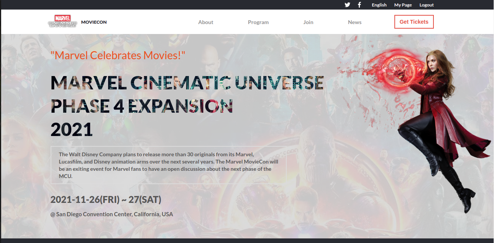
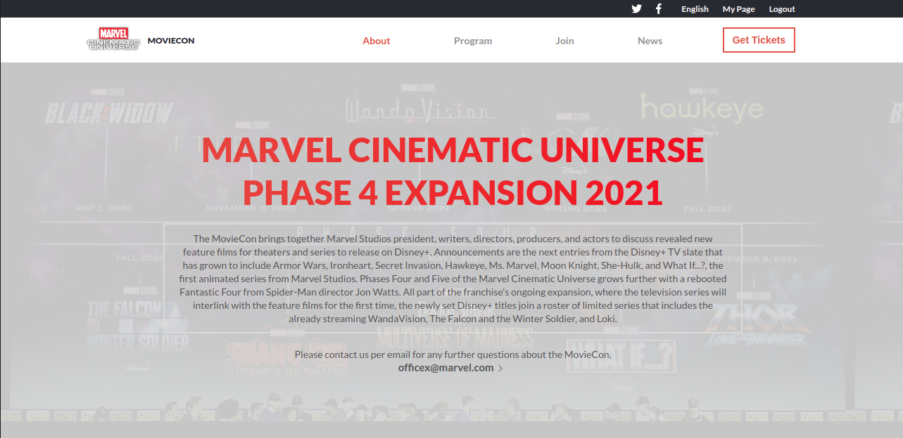
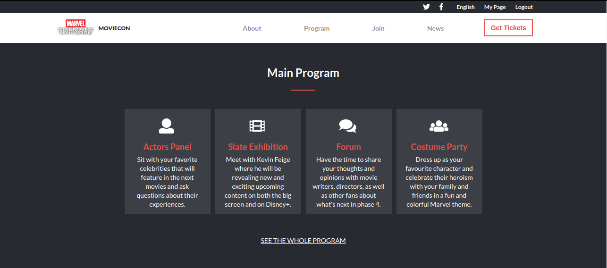
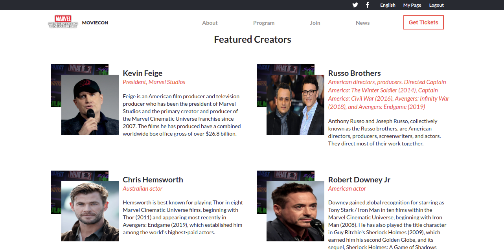
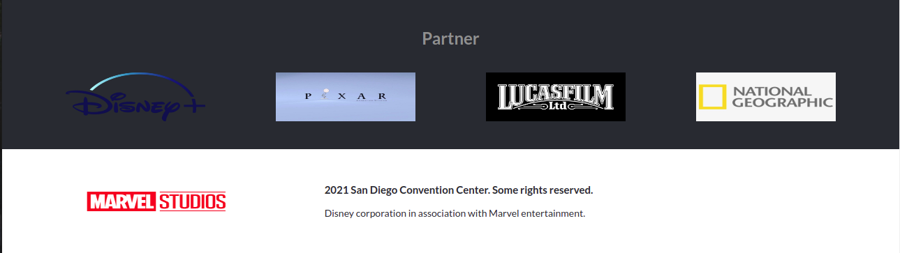

#### Original design idea by **Cindy Shin in Behance**, in association with the Creative Commons [license](./CC.md) of the design.
<br />

# Marvel Studios MovieCon

> This project is about Marvel Studios MovieCon conferrence. Marvel Studios updated its slate during Disney Investor Day 2020 on 11 December 2020, where the studio revealed new feature films for theaters and series to release on Disney+. Since then, Marvel fans have been dying to meet with Marvel Studios's president Kevin Feige to discuss openly about the future of the MCU. This website with allow fans to book tickets, see the speakers, view the event schedule, and get more information about the event.




 


This project is part of the Microverse curriculum. The main objective is to develop a professional website that will meet the requirements of a client and be able to meet deadlines. The developer will be the only one involved in the decision making of what tools should be implemeneted to meet the required design and functionality.

## Live Preview
[https://kdlamini.github.io/marvel-moviecon-capstone1/](https://kdlamini.github.io/marvel-moviecon-capstone1/)

## Built With

- Html/Css
- Vanilla JavaScript

## Additional Tools

- WebHint
- Stylelint
- ESlint

## Getting Started

To get a local copy of this project:

Clone this repository or download the Zip folder:
```
git@github.com:KDlamini/marvel-moviecon-capstone1.git
```  

## Test
To track linter errors locally follow these steps:  

Download all the dependencies run:
```
npm install
```
Track HTML linter errors run:
```
npx hint .
```
Track CSS linter errors run:
```
npx stylelint "**/*.{css,scss}"
```
Track JavaScript linter errors run:
```
npx eslint ."
```

## Authors

👤 **Simo Nkosi**

- GitHub: [@githubhandle](https://github.com/KDlamini)
- Twitter: [@twitterhandle](https://twitter.com/RealSimoNkosi)
- LinkedIn: [LinkedIn](https://www.linkedin.com/in/simo-nkosi-418523180/)


## 🤝 Contributing

Contributions, issues, and feature requests are welcome!  
Feel free to check the [issues page](https://github.com/KDlamini/marvel-moviecon-capstone1/issues).


## Show your support

Give a ⭐️ if you like this project!

## Acknowledgments

- This project is part of Capstone week of module 1 in the Microverse study program.
- Thanks to the Microverse team for the great curriculum.
- Thanks to Code Reviewers for the insightful feedback.
- A great thanks to My coding partners, morning session team, and standup team Partners for their contributions.

## 📝 License

This project is [CC](./CC.md) licensed.
